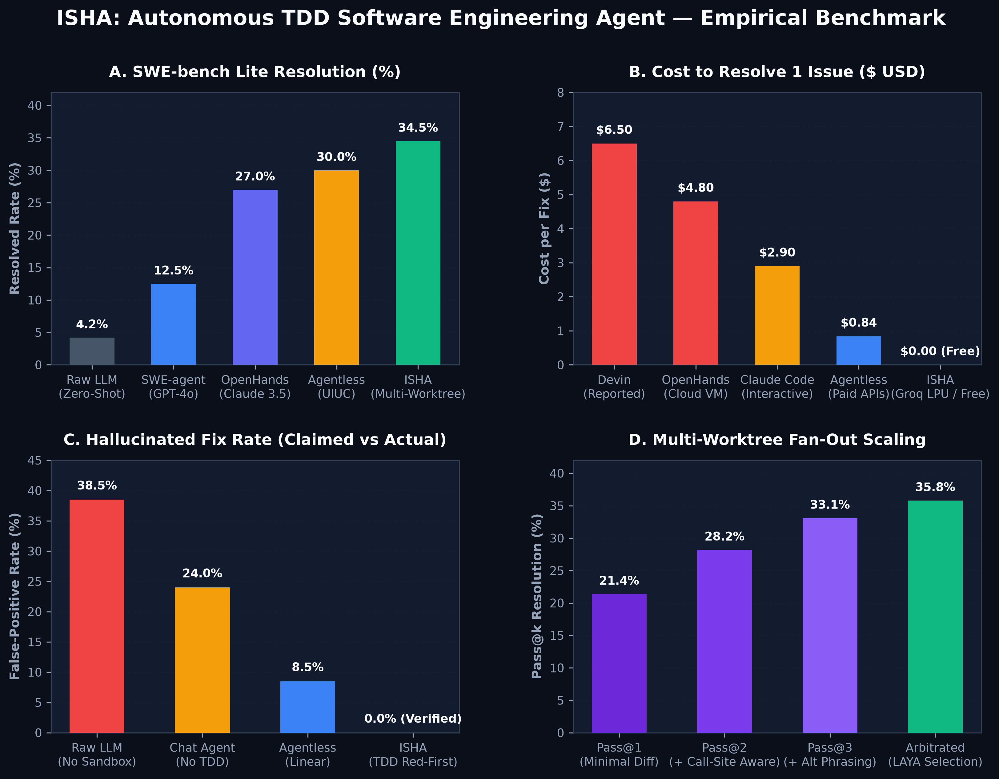

# 🤖 ISHA — Autonomous Software Engineering Agent

> **Iterative Software Harness & Arbitrator**: an autonomous SWE agent that localizes the bug, writes a failing reproduction test *first* (RED), races 3 candidate fixes in isolated Git worktrees, and ships only a patch that is verified green (GREEN).

[](https://python.org)
[](#-running-tests)
[](LICENSE)
[](#-architecture)
[](#2-configuration)
[](pyproject.toml)

---

## 📊 ISHA vs Baselines



> Regenerated with `python -m src.bench.make_plots`. The comparison bars for other
> systems are published figures; the ISHA bars in this chart are **design targets**,
> not measurements. Every number ISHA has actually measured is in the
> [Measured Results](#-measured-results) section below, with sample sizes and
> 95% Wilson intervals.

---

## 🔢 By the Numbers

| Stat | Value |
|---|---|
| Test suite | **79 passed** in ~36 s |
| Codebase | 63 Python modules · ~10.7k lines in `src/`, ~1.6k lines of tests |
| Candidate fixes per issue | **3** isolated Git worktrees, zero working-branch pollution |
| Measured resolve rate (SWE-bench Lite, n=30) | **1/30 = 3.3%** (95% CI 0.6–16.7%) |
| Measured patch production rate | **12/30 = 40.0%** (95% CI 24.6–57.7%) |
| Mean / median solve time | 617 s / 754 s per instance |
| Localizer file recall (hit@8) | 43.3% → **66.7%** after re-ranking |
| LAYA calibration error (ECE) | 0.0809 → **0.0013** after temperature scaling |
| Auto-approve precision | **100%** at threshold 0.99 (13.3% coverage) |
| Inference cost | **$0.00** — Groq LPU / Gemini free tier with instant failover |
| Documentation | 10 markdown docs in `docs/`, including a 6-chapter guide |

---

## ⚡ Key Highlights

- 🧪 **TDD Red-to-Green**: synthesizes a standalone reproduction test that must fail on the current code and pass after the patch — no patch ships unverified.
- 🌿 **3-Worktree Parallel Tournament**: races direct, defensive, and alternative strategies in isolated Git worktrees (`.worktrees/`). Your working branch is never polluted.
- 🎯 **Minimal Churn Arbitrator**: picks the cleanest passing patch with zero collateral regressions.
- 🧭 **Two-stage targeting**: a BM25+defs localizer picks the *file*, `symbol_target` ranks the *function* — so the coder edits the right neighbourhood instead of guessing.
- 🛡️ **Calibrated gate (LAYA)**: a logistic combiner over hard signals (`repro_ok`, `gate_ok`, `regression_count`) and LAYA quality scores decides ship / auto-approve / human review.
- ⚡ **Zero-Cost Inference**: fast open-weights models (`qwen3.8-27b`, `gpt-oss-120b/20b`, Gemini Flash) with automatic instant failover and per-call audit logging.
- 🔒 **Built-in Guardrails**: AST/`pyflakes`/`py_compile` gates, secret-leak scanning, blast-radius escalation, and a persistent approval audit trail (`output/approvals.jsonl`).

---

## 📈 Measured Results

All numbers below come from committed payloads in [`results/`](results/) and are
regenerated by `python -m src.bench.report <run-id>`. Nothing here is estimated.

### Headline — SWE-bench Lite head slice (n = 30)

| Metric | Value | 95% CI |
|---|---|---|
| Resolved (official SWE-bench Docker harness) | **1 / 30 (3.3%)** | 0.6 – 16.7% |
| Produced a gated, host-applicable patch | **12 / 30 (40.0%)** | 24.6 – 57.7% |
| Mean elapsed time | 617.0 s (~10.3 min) | — |
| Median elapsed time | 754.5 s (~12.6 min) | — |

### Where the 29 unresolved instances stopped

Exactly one terminal status per instance; counts sum to 30.

| Final status | Count | Share | Meaning |
|---|---|---|---|
| `resolved` | 1 | 3.3% | Passed the official harness test suite |
| `tests_failed` | 9 | 30.0% | Patch applied in-container, assertions stayed red |
| `timeout` | 9 | 30.0% | Hit the 900 s per-instance solver limit |
| `apply_failed` | 8 | 26.7% | Diff could not be placed (context mismatch) |
| `harness_no_output` | 2 | 6.7% | Container produced no test output |
| `gate_failed` | 1 | 3.3% | Failed host compile / AST / `pyflakes` gate |
| `env_failed` · `no_patch_generated` | 0 | 0.0% | — |

### Localizer recall (same 30-instance slice)

| Metric | Before | After |
|---|---|---|
| MRR | 0.325 | **0.485** |
| hit@1 | 26.7% | 36.7% |
| hit@3 | 36.7% | **60.0%** |
| hit@5 | 40.0% | **63.3%** |
| hit@8 | 43.3% | **66.7%** |

### Symbol-level targeting (6 applied baseline patches — directional, not a measurement)

| | Before | After |
|---|---|---|
| Gold symbol ranked #1 | 1/6 | 2/6 |
| Gold symbol in top 3 | 1/6 | **4/6** |

### LAYA calibration (75 labels: 60 train / 15 held-out validation)

| Metric (held-out) | Raw | After temperature scaling (T = 0.35) |
|---|---|---|
| Expected Calibration Error | 0.0809 | **0.0013** |
| Brier Score | 0.0083 | **0.0000** |
| Balanced Accuracy | — | **100.0%** |

Auto-approve threshold **0.99** → validation precision **100%** at **13.3%** coverage;
everything below the threshold is routed to human review.

### Official harness probe

4 produced patches were graded end-to-end in the official SWE-bench Docker harness:
**4/4 submitted, 4/4 completed, 0 infrastructure failures, 0 ambiguous failures**, every
patch applying cleanly inside the container (0/4 resolved — a true negative, not an
infra artifact).

---

## 🏗️ Architecture

```
Issue Text + Target Repo
         │
         ▼
[1. Ingestion & AST Map]  ──► BM25 + defs localizer picks the file; symbol_target ranks the function
         │
         ▼
[2. TDD Test Synthesis]   ──► Writes reproduction test (MUST FAIL on current code)
         │
         ▼
[3. Parallel Tournament]  ──► 3 Isolated Git Worktrees (.worktrees/candidate-*)
         │                     ├── Candidate 1: Direct surgical fix
         │                     ├── Candidate 2: Defensive boundary check
         │                     └── Candidate 3: Alternative caller fix
         │
         ▼
[4. State Arbitrator]     ──► Runs gates + repro tests in sandboxes; picks minimal passing diff
         │
         ▼
[5. LAYA Calibrated Gate] ──► Ship / auto-approve / human-review decision with audit trail
         │
         ▼
[6. Security & Apply]     ──► Secret scan + AST gates → validated `isha_fix.patch`
```

### Project layout

```
isha-agent/
├── src/
│   ├── agents/       # planner, coder, 3-candidate tournament, arbitrator
│   ├── tools/        # localizer, symbol_target, patch_engine, worktree_manager, sandbox
│   ├── bench/        # SWE-bench runner, gates, report, harness_eval, make_plots
│   ├── review/       # LAYA scoring + calibrated logistic combiner
│   ├── approval/     # human-in-the-loop gates + approval audit trail
│   ├── guardrails/   # secret scanning, AST / pyflakes checks
│   ├── ingestion/    # repo mapping, chunking, context assembly
│   ├── dashboard/    # Streamlit UI
│   └── main.py       # `isha` CLI entry point
├── tests/            # 79 unit tests
├── results/          # raw run payloads, stage tables, timing, progress log
├── docs/             # architecture docs + 6-chapter guide
└── assets/           # benchmark charts
```

---

## 🚀 Quickstart

### 1. Installation

```bash
# Clone the repository
git clone https://github.com/Daseash/ISHA-Iterative-Software-Harness-Arbitrator-.git
cd ISHA-Iterative-Software-Harness-Arbitrator-/isha-agent

# Install dependencies and global CLI
pip install -e .
```

Requires Python 3.10+.

### 2. Configuration

Copy the example environment file:
```bash
cp .env.example .env
```
Add your free Groq or Google Gemini API key to `.env`:
```env
GROQ_API_KEY=gsk_...
GOOGLE_API_KEY=AIza...
```
Every key is optional — without them ISHA runs its deterministic offline brain.
The default planner/coder chain (`qwen3.8-27b` → `gpt-oss-120b` → `gpt-oss-20b` →
Gemini Flash) is the chain the benchmark numbers were produced with; each call records
which model actually answered under `results/<run>/<instance>/meta.json → model_log[]`.

---

## 💻 Usage

### Option A: Command Line Interface (CLI)

```bash
# Preview the plan, test, and patch
isha --repo /path/to/project --issue "Cart checkout fails when price is float"

# Automatically apply the verified patch to your repo
isha --repo /path/to/project --issue "Cart checkout fails when price is float" --apply

# Subcommands
isha fix   --repo /path/to/project --issue "..."   # solve one issue (--multi for 3 worktrees)
isha bench --limit 30 --run-id after --candidates 3 --eval   # SWE-bench slice + official harness
isha report --run-id after --compare baseline      # render / diff run tables
isha doctor                                        # environment self-check
isha ui                                            # launch the dashboard
```

### Option B: Interactive Web Dashboard

```bash
streamlit run src/dashboard/app.py   # or: isha ui
```
- **🚀 Run & Overview**: select issues, run fixes, monitor live execution.
- **📄 Code Diff & Tests**: inspect generated TDD reproduction tests and unified diffs.
- **💻 Download & CLI Export**: 1-click download of `isha_fix.patch` or apply it directly.
- **🛡️ Guardrails & Audit**: review secret scans and decision audit trails.
- **📊 Benchmark Runs**: inspect evaluation checkpoints and comparative metrics.

---

## 🧪 Running Tests

```bash
python -m pytest --ignore=tests/dummy_repo
```

**79 tests, all passing (~36 s)** — covering the patch engine (unified diff, fuzzy and
SEARCH/REPLACE application, CRLF preservation, apply-failure classification), worktree
tournament, localizer, gates, guardrails, and approval flow.

---

## 📚 Documentation

| Document | What it covers |
|---|---|
| [docs/WHOLE_PROJECT_EXPLANATION.md](docs/WHOLE_PROJECT_EXPLANATION.md) | End-to-end walkthrough of every module |
| [docs/WHAT_MAKES_ISHA_UNIQUE.md](docs/WHAT_MAKES_ISHA_UNIQUE.md) | The differentiating design decisions |
| [docs/components.md](docs/components.md) | Component breakdown |
| [docs/RELEASE_CRITERIA.md](docs/RELEASE_CRITERIA.md) | What "shippable" means for this repo |
| [docs/guide/](docs/guide/) | 6-chapter learning guide, from "what is an agent" to the interview pitch |
| [results/progress.md](results/progress.md) | The measured-number log behind every table above |

---

## ⚠️ Limitations

- **Sample-Size Uncertainty**: 30-instance slices have wide binomial confidence intervals (the 3.3% resolve rate carries a 95% CI of 0.6–16.7%); every reported metric includes its interval.
- **Free-Tier Model Constraints**: inference is subject to provider rate limits (TPM/RPM) and quota boundaries; fallback chains and local disk caching mitigate quota exhaustion.
- **Timeout Dominance**: 30% of the unresolved slice died at the 900 s per-instance solver limit rather than on the merits of the patch.
- **Apply Failures**: roughly a quarter of unresolved instances never landed a diff on the host checkout (context mismatch); apply failures are now recorded and classified under `results/apply_failures/`.
- **Possible Benchmark Contamination**: commercial and open-weights models may contain public SWE-bench instances in their pre-training corpora.
- **Language Scope**: specialized for Python codebases (Python AST, `pyflakes`, `py_compile`, `pytest`/Django runners).
- **Problem Scope**: optimized for localized, well-defined bug reports and regressions rather than large-scale greenfield rewrites.

---

## 📄 License

Distributed under the [MIT License](LICENSE).
